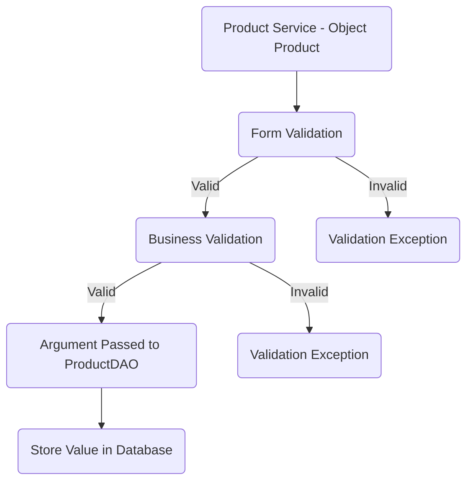
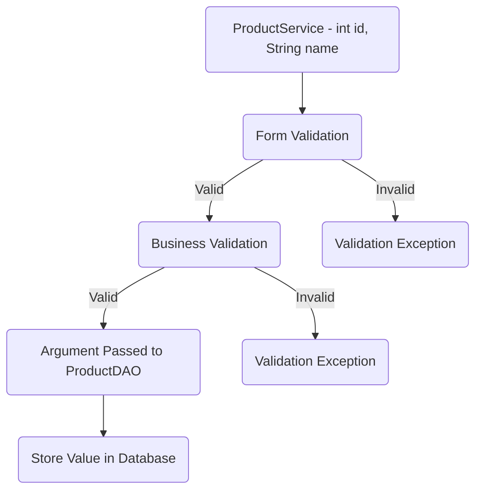
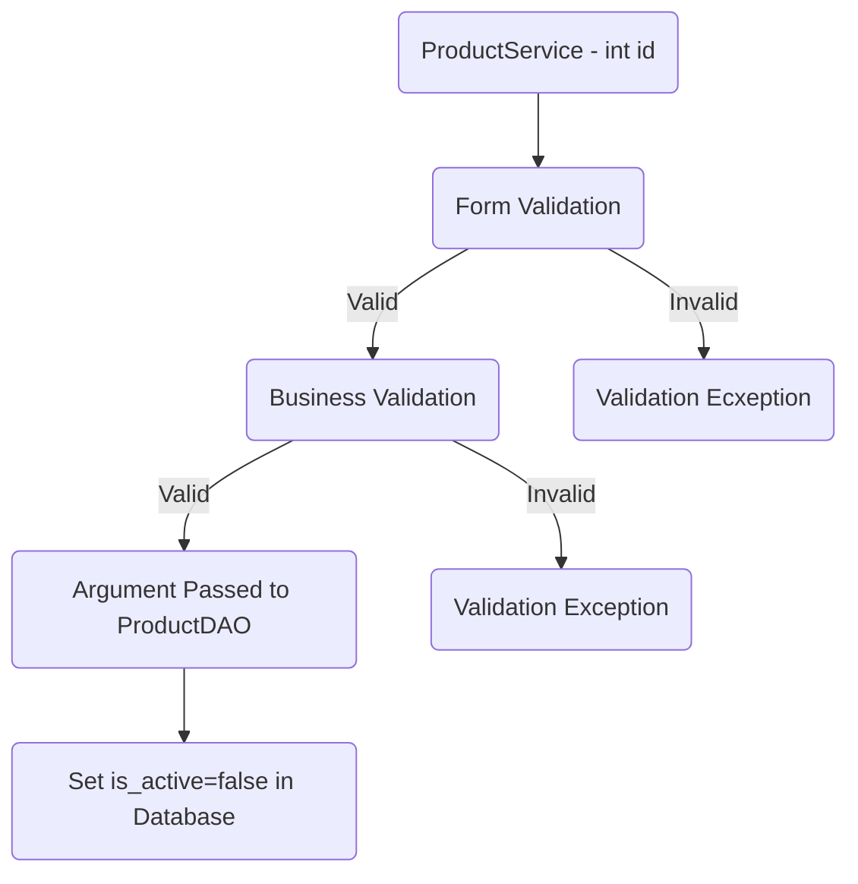
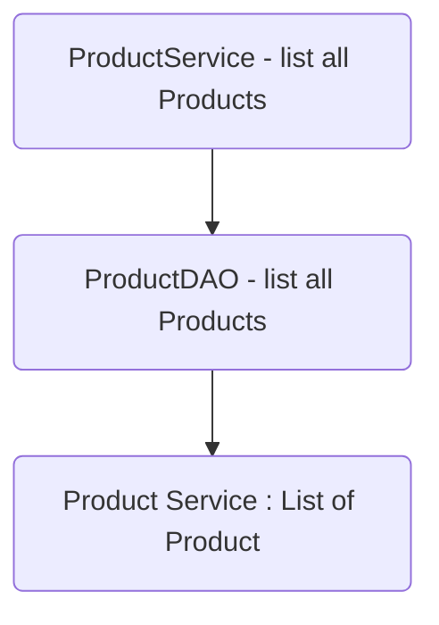
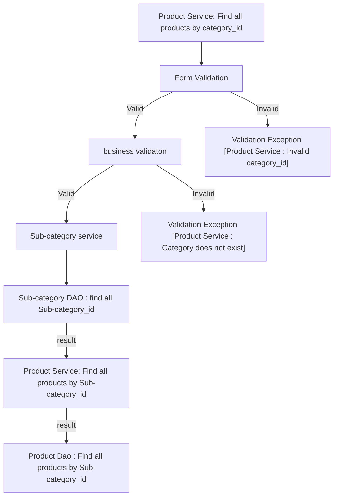

# Jaunty Rialto Checklist

## Database Design

- [ ] Write Create table scripts [script](src/main/resources/db/migration/V1__create_users.sql)

- [ ] ER Diagram:  
## Project Setup

- [ ] Create a new Java project
- [ ] Set up a MySQL database
- [ ] Add necessary libraries
	- [ ] JDBC, 
	- [ ] MySQL Connector, 
	- [ ] JUnit, 
	- [ ] Dot env

## Module 1: Product

* Attributes
	* int id
	* int sub-category-id
	* String name
	* String description
	* double price
	* Boolean is-active

### Feature 1 : Create Product 

### User story :
		Product will create successfully and the Product details will be stored in database.

### Pre-requisites:
- [ ] Create Category table
- [ ] Category model
- [ ] Category DAO (find all), (find by id)
- [ ] Category service (find all), (find by id)
- [ ] Create Sub-Category table
- [ ] Subcategory model
- [ ] Subcategory DAO (find all), (find by id)
- [ ] Subcategory service (find all), (find by id)
- [ ] Product table
- [ ] Product model
- [ ] Product DAO (create)
- [ ] Product service 

#### Validations:  

- [ ] Form validator  
	* Product ( null )  
	* price <= 0
	* name ( null, empty)  
	* description( null, empty)

- [ ] Business validator 
	* sub-category-id (exist) 
	* category-id (exist)
 
#### Messages:  

* Product object cannot be null  
* Name cannot be null or empty
* description cannot be null or empty
* Price cannot be less than or equal to zero
* Price does not match the pattern
* sub-category does not exist
* category does not exist

#### Flow:  
> Invalid When a Product 's name is already in use or when the input provided does not meet the criteria, Product  arise.


### Feature 2 : Update Product 

### User story :
>Product details will successfully update and store in database.

### Pre-requisites:
- [ ] completed feature 1 - create Product 
- [ ] Product DAO( update )
- [ ] Product service ( update ) 

#### Validations:  

- [ ] Form validator  
	* id (less than or equal to 0) 
	* name ( null, empty)  
	* description(null , empty)

- [ ] Business Validation  
	* Check whether the id exist

#### Messages:  

* Id cannot be 0 or negative  
* Name cannot be null or empty
* description cannot be null or empty
* id does not exist 

#### Flow:  
>  Invalid When a Product 's name is not in use or when the input provided does not meet the criteria, Product arise.


### Feature 3 : Delete Product 

### User story :

>The product will be deleted from database.

### Pre-requisites:
- [ ] completed feature 1 - create Product 
- [ ] Product DAO( delete )
- [ ] Product service ( delete )

#### Validations:  

- [ ]  Form Validation 
	* id (less than or equal to 0)
	* name(null, empty, pattern)

- [ ] Business Validation  
	* Check whether the id exist

#### Messages:  

* Id cannot be 0 or in negative  
* description cannot be null or empty
* Name cannot be null or empty
* Product not found  

#### Flow:  
> Invalid When a Product 's name is not in use or when the input provided does not meet the criteria, Product arise.


### Feature 4 : List all Products

### User story :

		User will get all the Products stored in the database.

### Pre-requisites :
- [ ] Product table
- [ ] Product model
- [ ] Product DAO (list all products)
- [ ] Product service (list all products)
 
### Flow:  


###  Feature 5 : List all Products by category-id

>Find all products by category-id from  Database
>
### User story :
		User will get all the products by the category_id
		
### Pre-requisites :

- [ ] Create Category table
- [ ] Category model
- [ ] Category DAO (find all), (find by id)
- [ ] Category service (find all), (find by id)
- [ ] Create Sub-Category table
- [ ] Subcategory model
- [ ] Subcategory DAO (find all),(find by id)
- [ ] Subcategory service (find all),(find by id)
- [ ] Product table
- [ ] Product model
- [ ] Product DAO (find all products by the category-id)
- [ ] Product service (find all products by the category-id)

#### Validations:

 - [ ] Form validation
    -  Sub-category-id <= 0

 - [ ] business validation
     - Category does not exists  

#### Messages:

  * Category id should not be less than or equal to 0
  * Category does not exists

#### Flow:


### Feature 6: List all Products by Sub-category-id

>  Find Products by Sub-category-id from database

### User story :
			User will get all the products by the Sub-category-id
		
### Pre-requisites :
- [ ] complete feature 1 - create Product
- [ ] Create Sub-Category table
- [ ] Subcategory DAO (find all), (find by id)
- [ ] Subcategory service (find all), (find by id)
- [ ] Create Product table
- [ ] Product DAO ( find all products by Sub-category-id)
- [ ] Product service ( find all products by Sub-category-id)

#### Validations:

 - [ ] Form validation
    -  Sub-category-id <= 0

 - [ ] business validation
     - Sub-category does not exists  

#### Messages:

  * Sub-category id should not be less than or equal to 0
  * Sub-category does not exists

#### Flow:

```mermaid

graph TD;

 A[Product Service: Find all products by Sub-category_id] --> B[Form Validation]

  B -- Valid--> C[business validaton] -- Valid --> D["Product Dao : Find all products by Sub-category_id"]

  C -- Invalid --> F["Validation Exception [Product Service : Sub-category does not exist]"]

  B -- Invalid --> G["Validation Exception [Product Service : Invalid Sub-category_id]"]

  ```
  
